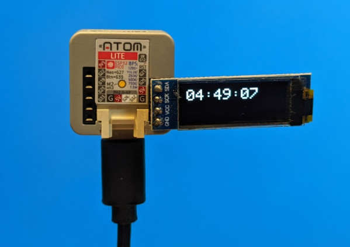

# M5Atom_NTPClock
M5 ATOM Lite + OLED で作るNTP時計です。  
OLEDは、AliExpressなどで安価に販売されている以下のものを使用しました。  

* 1.49US $ 10% OFF|1 個 0.91 インチの oled モジュール 0.91  https://ja.aliexpress.com/item/32672229793.html


ソースコード中のWiFi設定は、ご自身の環境に合わせて変更してください。  
```
// WiFi
static const char* ssid        = "****";
static const char* password    = "****";
```

### 動作の様子
  

### ボード設定
  
